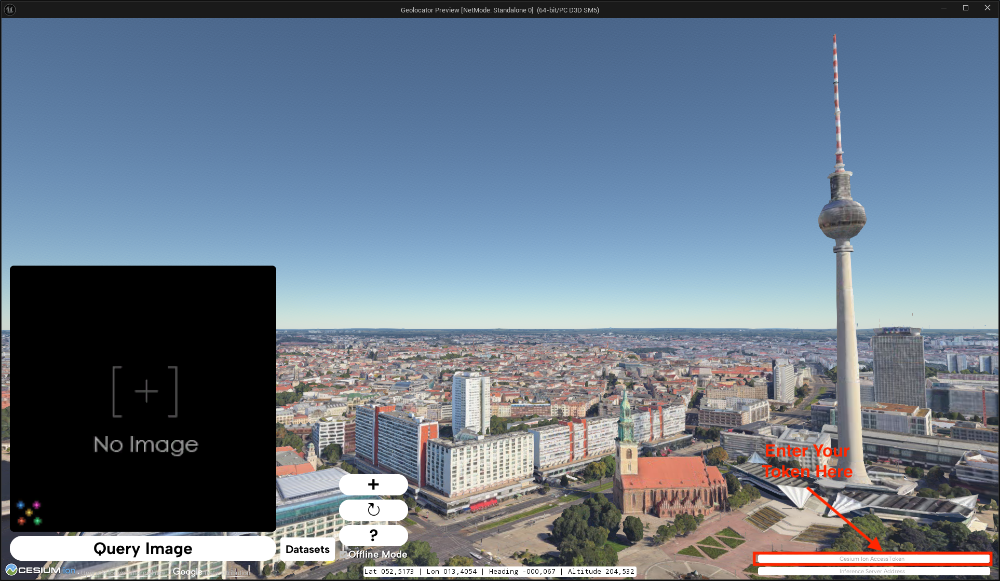
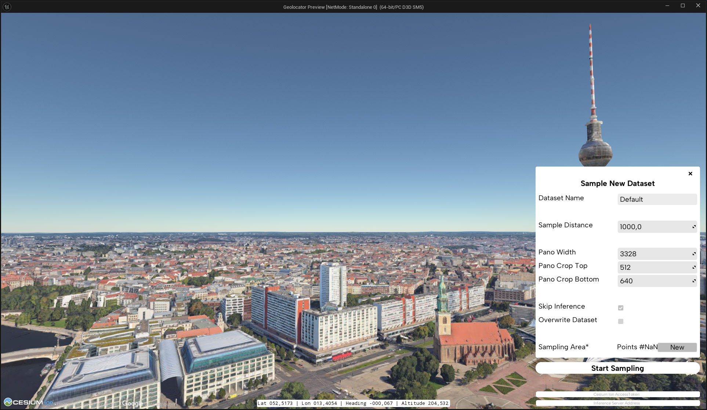
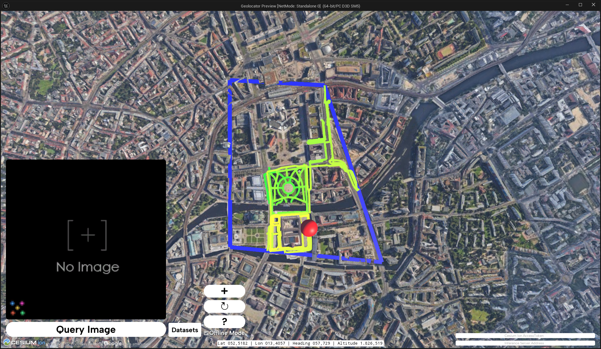
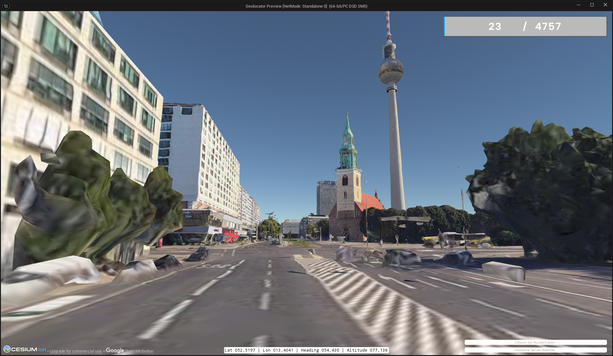

# Mesh Data Synthesizer: Data Generation and Visual Place Recognition using Unreal Engine and Cesium

> [!WARNING]  
> **🏗️ This README is still under construction.** More Information will be added in the future. In the meantime, if you have any questions feel free to open an issue.
Currently, it focuses on the data generation features of the tool. The code for the live inference and search features are already available, but they are not yet documented.

<p float="left">
  
  
  
</p>

<br />

Photorealistic 3D meshes open up new possibilities for generating and leveraging data for various applications, including data generation for large-scale geospatial analysis. This project, titled "Someplace," focuses on the creation of high-quality, synthetic datasets using 3D models, which can be applied to a range of tasks such as visual place recognition.

[[Video](https://www.youtube.com/watch?v=rWF-LfsDJKA)] [[Paper](https://mesh-vpr.github.io/)]

## Future Work

> [!IMPORTANT]  
> I currently have very limited time and resources to work on this project. I have no idea when or if these features will be completed.

- Improve documentation
- Properly separate Mesh Data Synth from Mesh based VPR
  - Currently, both are tightly coupled, since VPR was the main use case for this project
- Improve Stability
  - Currently, mostly the happy path is supported a lot of errors will lead to crashes or give no feedback
- Support Generation of data other than RGB images (for example, depth)
- Make it easier to implement custom data generators
  - E.g. drone/birds-eye perspectives

## Table of Contents

- [Project Structure](#project-structure)
- [Data Generation](#data-generation)
  - [Available 3D Models](#available-3d-models)
  - [Generating a new dataset](#generating-a-new-dataset)
  - [Custom dataset generation](#custom-dataset-generation)
- [Inference](#inference)
- [Searching (Geo Location Queries)](#searching-geo-location-queries)
- [MeshVPR](#meshvpr)

## Project Structure

The project consists of two parts, first a data generation tool using Unreal Engine and Cesium, and second code for utilizing the generated data for visual place recognition.

- `MeshSynth` contains the Unreal Engine project and relevant assets.
  - This code is used to generate images for a certain area
  - It also contains a UI which allows the user to query the geolocation of an image
- `VprServer` contains the server code which can be used to manage a database of features and query the geolocation of an image
  - You can completely ignore this folder if you are only interested in generating images

## Data Generation

### Available 3D Models

The Tool requires 3D models to be in the [3D Tiles format](https://github.com/CesiumGS/3d-tiles).
Cesium 3D Tiles are an open specification for streaming massive heterogeneous 3D geospatial datasets.
They are visualizes in the Unreal Engine using the [Cesium for Unreal plugin](https://github.com/CesiumGS/cesium-unreal).
The easiest way to access model data source for large scale 3D models is [Cesium Ion](https://cesium.com/ion/).

The packaged version of this tool requires you to enter a [Cesium Ion Access Token](https://cesium.com/learn/ion/cesium-ion-access-tokens/) in the UI.



The default model used here is the [Photorealistic 3D Tiles](https://developers.google.com/maps/documentation/tile/3d-tiles) by Google.
If you want to use another model from Cesium you will have to open the project in Unreal Engine and modify/add a level.
Some example levels with different models can be found in the `Content/ECCV_2024` folder.
You are also able to stream models from a host other than Cesium Ion see [Loading datasets from other sources](https://cesium.com/learn/unreal/unreal-datasets/#loading-datasets-from-other-sources).

You can find a selection of available models from Cesium Ion and other sources in the table below.

**License information could be invalid or subject to change, please verify the license of the model before using it.**

| Model Name                                        | Description                                                                                                                                                                                                                                                                                                                                                                                                                                                                                                                                                      | Links                                                                                                                              | License                                                                                                                                                                                                                                      |
| ------------------------------------------------- | ---------------------------------------------------------------------------------------------------------------------------------------------------------------------------------------------------------------------------------------------------------------------------------------------------------------------------------------------------------------------------------------------------------------------------------------------------------------------------------------------------------------------------------------------------------------- | ---------------------------------------------------------------------------------------------------------------------------------- | -------------------------------------------------------------------------------------------------------------------------------------------------------------------------------------------------------------------------------------------- |
| Google Photorealistic 3D Tiles                    | Photorealistic 3D Tiles are a 3D mesh textured with high resolution imagery. They offer high-resolution 3D maps in many of the world's populated areas. They let you power next-generation, immersive 3D visualization experiences to help your users:                                                                                                                                                                                                                                                                                                           | [Cesium Tutorial for Photorealistic 3D Tiles](https://cesium.com/learn/photorealistic-3d-tiles-learn) <br /><br /> [Google Developer Documentation for Photorealistic 3D Tiles](https://developers.google.com/maps/documentation/tile/3d-tiles)      | **Free for Non-Commercial via Cesium Ion** <br /><br /> [Cesium Ion Pricing](https://cesium.com/platform/cesium-ion/pricing/) <br /><br /> [Google Maps Platform ToS](https://cloud.google.com/maps-platform/terms) apply                                                                                                                                            |
| Aerometrex San Francisco High Resolution 3D Model | The Aerometrex San Francisco High Resolution 3D Model with Street Level Enhanced 3D has been generated using advanced aerial acquisition and photogrammetry techniques that extract accurate geometric information from aerial photographs. Extremely dense 3D point clouds are generated prior to being transformed into a fully-textured mesh object. To generate geographically accurate data, precise ground control points are integrated into the processing chain. Special care and quality control systems are implemented at all stages of the process. | [Cesium Blog Post on San Francisco](https://cesium.com/blog/2022/12/13/aerometrex-san-francisco-data-now-available-on-cesium/) <br /><br /> [Aerometrex Models](https://aerometrex.com/models/)    | **Trial** <br /><br /> This data is available for non-commercial trial and evaluation purposes only until December 18th, 2024 on Cesium Ion. For commercial use, or for use beyond the trial and evaluation period, please contact the Aerometrex. |
| Melbourne                                         | Photogrammetry of Melbourne, Australia captured in May 2018. This dataset is derived from 7.5cm ground sample distance. It represents all physical features (building, trees and terrain) across the City of Melbourne.                                                                                                                                                                                                                                                                                                                                          | [Cesium Ion Platform](https://cesium.com/platform/cesium-ion/)                                                                                            | **CC-BY 4.0** <br /><br /> [City Of Melbourne Data Platform](https://data.melbourne.vic.gov.au/explore/dataset/city-of-melbourne-3d-textured-mesh-photomesh-2018/)                                                                                                                    |
| Japan 3D Buildings                                | Cesium’s Japan 3D Buildings dataset is a 3D Tiles layer with approximately 23 million individual buildings across the country of Japan. The data is available as a 3D Tileset on Cesium Ion. The data is derived from Japan’s MLIT Project PLATEAU 3D City Model GML data and contains building data from over 210 wards, cities, towns, and villages across Japan.                                                                                                                                                                                              | [Cesium Blog Post on Japan](https://cesium.com/platform/cesium-ion/content/japan-3d-buildings/)                                                                 | **Free for Commercial & Non-Commercial** <br /><br /> PLATEAU data provided by the Japanese Ministry of Land, Infrastructure, Transport and Tourism                                                                                                |
| Berlin                                            | Since 2009, the Business Location Center in Berlin has been successfully using 3D city models to virtually represent the economic region of Berlin. Since 2019, a textured 3D mesh model shows the German capital, which was automatically derived from a survey flight. The current 3D mesh model is based on the aerial survey from August 2023 and also includes Berlin Brandenburg Airport BER.                                                                                                                                                              | [City of Berlin Data Platform](https://www.businesslocationcenter.de/en/economic-atlas/download-portal) (3D Mesh 2023) <br /><br /> [Virtual City Systems viewer for the same model](https://www.virtualcitymap.de) (3D Mesh 2020) | **Free for Commercial & Non-Commercial** <br /><br /> [Berlin Model Licensing Terms](https://www.businesslocationcenter.de/berlin3d-downloadportal/templates/en/datenschutzhinweise.html)                                                                                          |
| Vexcel 3D City Models                             | Ready-made, high-quality 3D data models for more than 60 metro areas across the globe.                                                                                                                                                                                                                                                                                                                                                                                                                                                                           | [Vexcel 3D City Model Overview](https://vexceldata.com/products/3d-cities/)                                                                                         | **Paid/Commercial** <br /><br /> Sidney is available for demonstration and evaluation purposes on Cesium Ion.                                                                                                                                      |

More models are listed in the asset depot of Cesium Ion https://ion.cesium.com/assetdepot/

### Generating a new dataset

Click the **+** button on the left to open the dataset generation menu.



Enter your parameters. The most important one is the selection of the sampling area.
To mark an area, click on the "New" Button next Sampling Area Label.
Afterwards repeatedly click on the map to add new points to your polygon.
If you are unhappy with your selection, you can start again by clicking "New" again.


After you are happy with your parameters hit the "Start Sampling" button.
This will start the generation of the dataset.

1. OpenStreetMap will be queried to get the streets in the area.
2. The streets will be used to build a path that the camera will follow.
3. The camera will take images along the path.

The images will be saved in the `MeshSynth/Saved/` folder. Metadata will be encoded in the filename following the format:

```
@UTM_east@UTM_north@UTM_zone_number@UTM_zone_letter@latitude@longitude@pano_id@tile_num@heading@pitch@roll@altitude@timestamp@note@extension
```





### Custom dataset generation

The code of this repo contains other sampling utilities, that can be used to generate datasets that are not bound to streets.
As a starter you can look at extending the `MTSamplerComponentBase`, you can also look at the implementations `MTWayGraphSamplerComponent` (Street/OSM based), `MTReSamplerComponent` (CSV based) and `MTExtraViewSamplerComponent` (Generate additional samples for an existing dataset).

More detailed instructions might follow in the future.

## Inference

> [!WARNING]  
> 🏗️ Docs under construction

The relevant code is inside the Server Directory.
This code is used to manage a live database of features and query the geolocation of an image.
However, you can also modify parts of the code to cater evaluation needs e.g. by loading it 
into FAISS instead of a live vector DB.
You can also find a function that splits the panoramas into slices in the `app.py`.

The model currently hardcoded into the inference server is SALAD + SALAD-MeshVPR.
SALAD is automatically fetched from torchhub to get SALAD-MeshVPR head over to https://github.com/gmberton/MeshVPR

## Searching (Geo Location Queries)

> [!WARNING]  
> 🏗️ Docs under construction

This requires you to have the Server running in the background and a dataset loaded into the vector DB (Redis).
The server address must be set in the bottom right of the client UI (see images above).
If a server is connected you will be able to query the geolocation of an image by using the right side of the interface.

Make sure you uncheck the "Offline Mode" checkbox to enable the search functionality.

## MeshVPR

The underlying machine learning model to achieve the geolocation task is MeshVPR, a visual place recognition model that uses 3D meshes to match images across different locations. You can find the code for the model here https://github.com/gmberton/MeshVPR

The website for the paper can be found here https://meshvpr.github.io

### Cite

Here is the bibtex to cite our paper

```bibtex
@InProceedings{Berton_ECCV_2024_MeshVPR,
    author    = {Gabriele Berton, Lorenz Junglas, Riccardo Zaccone, Thomas Pollok, Barbara Caputo, Carlo Masone},
    title     = {MeshVPR: Citywide Visual Place Recognition Using 3D Meshes},
    booktitle = {European Conference on Computer Vision (ECCV)},
    year      = {2024},
}
```
